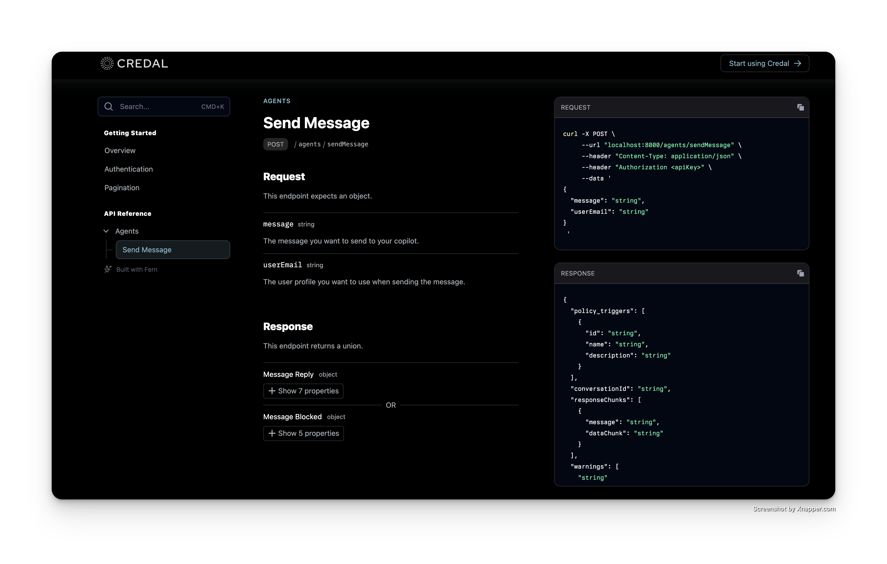

# Credal Documentation

Credal uses Fern for documentation. Checkout our docs at [https://credal.docs.buildwithfern.com](https://credal.docs.buildwithfern.com).

## What is contained in this repo ?

This reposistory contains:

- Credal's [API Definition](./fern/definition)
- MDX [Pages](./fern/docs/pages/)

## How to update the documentation ?

To update the documentation make a PR to this
repository. On pull-request we run `fern check`
to make sure that any edits to the documentation
are valid.

When the PR is merged, your changes will
automatically be deployed to the website.
